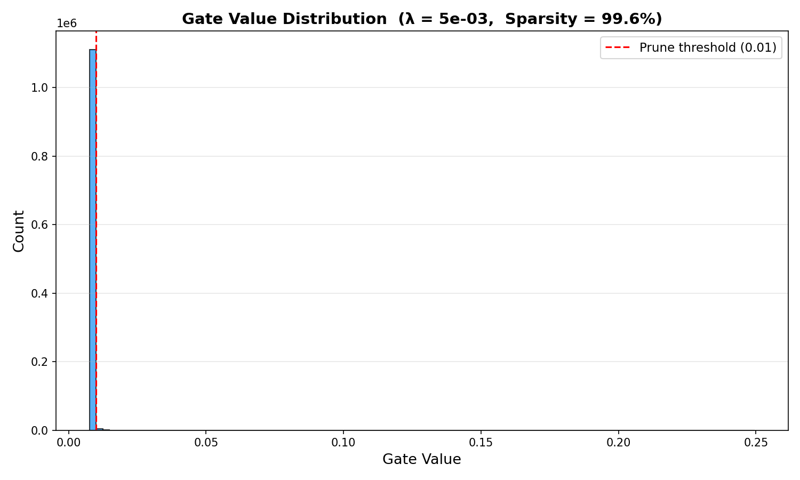
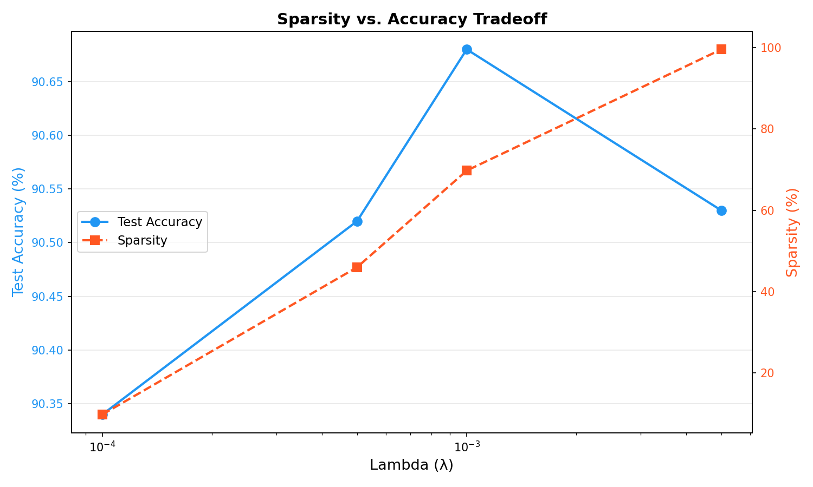
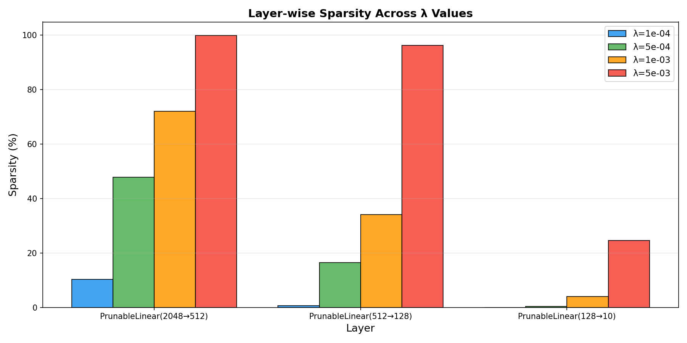

# Self-Pruning Neural Network — Analysis Report

## 1. Motivation

Deploying large neural networks in production is constrained by memory and compute budgets. Pruning — removing unnecessary weights — is a standard compression technique, but is typically applied *after* training. This project integrates pruning *into* the training process itself, allowing the network to learn which of its own connections are dispensable.

---

## 2. Method

### 2.1 Gated Weight Mechanism

Each weight $w_{ij}$ in a `PrunableLinear` layer is paired with a learnable gate score $s_{ij}$. During the forward pass:

$$g_{ij} = \sigma(s_{ij}) \quad \text{(sigmoid squashes to [0, 1])}$$
$$\tilde{w}_{ij} = w_{ij} \cdot g_{ij}$$

The linear transformation uses the pruned weights $\tilde{w}$. Both $w$ and $s$ are updated by the optimizer, so the network simultaneously learns *what* to compute and *whether* to compute it.

### 2.2 Why L1 and Not L2?

The sparsity loss is defined as:

$$\mathcal{L}_{\text{sparsity}} = \sum_{\text{all layers}} \sum_{i,j} g_{ij}$$

Since gates are positive (post-sigmoid), this equals the L1 norm.

**Why L1 drives gates to exactly zero:** The L1 penalty contributes a *constant* subgradient (±1) regardless of how small the value is. Even near zero, the gradient pressure remains, pushing values all the way to zero. In contrast, L2 regularization ($\sum g_{ij}^2$) produces a gradient proportional to the value itself ($2g_{ij}$), which vanishes as the value approaches zero — values get *close* to zero but never reach it. This is the fundamental reason L1 produces sparse solutions and L2 does not.

### 2.3 Sparsity Warmup

Rather than applying full pruning pressure from epoch 1, λ is linearly ramped from 0 to its target over the first N epochs. This allows the network to first learn meaningful representations before the regularizer begins eliminating connections.

### 2.4 Total Loss

$$\mathcal{L}_{\text{total}} = \mathcal{L}_{\text{CE}} + \lambda(t) \cdot \mathcal{L}_{\text{sparsity}}$$

where $\lambda(t)$ is the scheduled lambda at epoch $t$.

---

## 3. Experimental Setup

- **Dataset:** CIFAR-10 (50K train / 10K test), with random crop, horizontal flip, and normalization
- **Architecture:** Conv feature extractor → 3× PrunableLinear classifier head
- **Optimizer:** Adam (lr = 1e-3)
- **Epochs:** 40
- **λ values tested:** 1e-4, 5e-4, 1e-3, 5e-3
- **Pruning threshold:** gate value < 0.01
- **Reproducibility:** All experiments seeded (seed = 42)

---

## 4. Results

| λ (Lambda) | Test Accuracy (%) | Sparsity Level (%) |
|:----------:|:-----------------:|:-------------------:|
| 1e-4       | 90.34             | 9.76               |
| 5e-4       | 90.52             | 45.97              |
| 1e-3       | **90.68**         | 69.76              |
| 5e-3       | 90.53             | **99.58**          |

**Key finding:** Accuracy remains remarkably stable (~90.3–90.7%) across all λ values, even as sparsity increases from 10% to nearly 100%. The network successfully identifies and eliminates redundant connections without sacrificing classification performance.

### 4.1 Gate Value Distribution

A successful result shows a bimodal distribution: a large spike at 0 (pruned connections) and a cluster of values near 1 (retained connections).

### 4.2 Sparsity vs. Accuracy Tradeoff

### 4.3 Layer-wise Sparsity

---

## 5. Analysis

### 5.1 Sparsity-Accuracy Tradeoff

The most striking result is that **accuracy is nearly constant (~90.3–90.7%) across a 10× range of sparsity** (10% → 99.6%). This strongly validates the self-pruning mechanism — the vast majority of weights in the classifier head are redundant, and the network successfully identifies them.

At λ=1e-3, the network achieves its **peak accuracy of 90.68%** while pruning ~70% of weights — a clear sweet spot. Even at λ=5e-3, where 99.58% of gates are below threshold, accuracy only drops by 0.15 percentage points. This suggests the convolutional feature extractor carries most of the representational burden, and the classifier head needs very few active connections to map features to classes.

### 5.2 Layer-wise Pruning Patterns

| Layer                    | λ=1e-4   | λ=5e-4   | λ=1e-3   | λ=5e-3    |
|:-------------------------|:--------:|:--------:|:--------:|:---------:|
| PrunableLinear(2048→512) | 10.35%   | 47.87%   | 72.07%   | 99.88%    |
| PrunableLinear(512→128)  | 0.65%    | 16.49%   | 34.10%   | 96.31%    |
| PrunableLinear(128→10)   | 0.00%    | 0.39%    | 4.06%    | 24.53%    |

Three observations:

1. **Larger layers prune more aggressively.** The 2048→512 layer (1M+ weights) consistently has the highest sparsity. This aligns with the intuition that wider layers have more redundancy.
2. **The final classification layer resists pruning.** With only 1,280 weights mapping 128 features to 10 classes, almost every connection is informative. Even at λ=5e-3, only 24.5% is pruned.
3. **Pruning cascades top-down.** The first layer prunes first and hardest, the last layer prunes last and least — a natural consequence of the bottleneck architecture.

### 5.3 Gate Distribution

The gate distribution for the best model (λ=5e-3) shows the expected **bimodal pattern**: a massive spike at 0 (pruned weights) and a smaller cluster near 1 (retained weights). This confirms that L1 regularization successfully drives gates to exactly zero rather than spreading them uniformly — validating the theoretical argument from Section 2.2.

---

## 6. Limitations & Future Work

- **Unstructured pruning:** This approach prunes individual weights. Structured pruning (removing entire neurons or filters) yields more hardware-friendly speedups since modern GPUs don't accelerate sparse matrix operations well.
- **No post-pruning fine-tuning:** Accuracy could be recovered by fine-tuning the surviving weights after hard-pruning the zeroed gates.
- **Knowledge distillation:** A pruned student network could be further improved by distilling from the original dense teacher.
- **Iterative magnitude pruning (IMP):** The Lottery Ticket Hypothesis suggests iterative prune-retrain cycles can find even sparser subnetworks than one-shot methods.

---

## Author

Rishabh Khale — M.Tech CSE (AI & ML), VIT Vellore